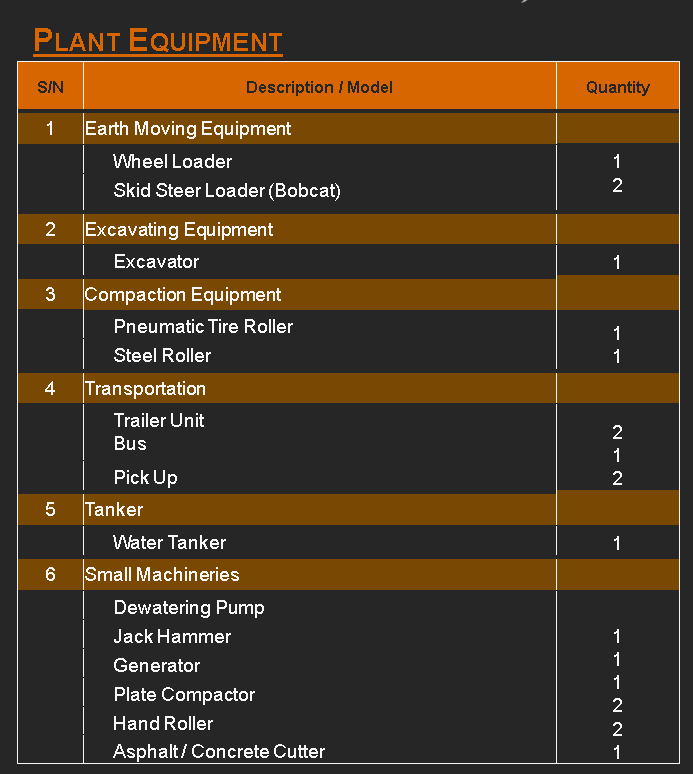

### Homepage Content

#### Hero Section
**Welcome to CPC Qatar**  
*Cosmo Projects and Construction & Trading*  
Your trusted partner in road construction and maintenance in Qatar. With years of expertise in earthworks, asphalt paving, and infrastructure development, we deliver quality, efficiency, and reliability on every project. Established in 2017, we've completed over 50 projects across Doha and beyond, serving government ministries, private developers, and international clients.  

[Call to Action Button: Get a Quote]  
[Background Image or Slider: Use company logo from PDF cover, or integrate searched images for visual appeal]

#### About Us Section
CPC Qatar's technical staff are well-trained and experienced in various fields of Engineering Services, drawing from long-gained experience with famous consultants, governments, and Kahramaa Company.  

Our project responsibilities include:  
- Project Planning  
- Construction Management  
- Engineering Supervision  
- Quality Assurance  
- Safety Inspection  
- Project Cost Control, Purchasing, and Material Supply  

**Mission:** To sustain a high level of qualified personnel and build a professional team committed to serving our clients. Our pledge is to establish lasting relationships by exceeding expectations and gaining trust through exceptional performance by every member of the construction team.  

**Objectives:** To be one of the leading firms in Qatar in road construction, offering excellent services with high-quality work and the latest technology.  

**Corporate Overview:** On behalf of CPC Qatar, we are pleased to introduce our local company, established to tackle new challenges in earthworks, especially asphalt pavements and road marking. We've proven our capacity through excellence in workmanship, professionalism, and timely completion. Guided by experienced management and specialized staff in each division.

#### Our Services Section
We specialize in the construction and maintenance of roads, promising to meet customer needs with the best products and applications—done right the first time with minimal inconvenience. We focus on quality, efficiency, and service to create significant value.  

Key activities include:  
- Earth works  
- Sub-grade works  
- Sub-base works  
- Asphalt works  
- Traffic signs and road marking  
- Interlock / kerbstone works  

With our expertise, we ensure projects comply with Qatar's standards and use cutting-edge technology for durable results.

#### Experience and Reliability Section
Since our establishment on 11/12/2017 (Commercial Registration No. 108122, valid until 08/12/2029), CPC Qatar has built a reputation for reliability. We're a Qatari company with limited liability, sponsored by Mohammed Ahmed Mubarak Al-Nasr, and partners including Hisham Abdel Fatah Radwan Mohamed (49% Egyptian ownership) and Mohd Ahmed M E (51% Qatari ownership).  

Our team handles everything from small parking lots to large infrastructure projects, with a track record of on-time delivery and budget adherence. We've worked with prestigious clients like the Ministry of Education, Qatar Museums, FIFA World Cup Qatar 2022, Al Meera, DHL, and various Sheikhs and private firms. Total project values exceed millions of QR, showcasing our scale and trustworthiness.  

**Organization Chart Highlights:**  
- General Manager  
- Human Resource Department (HR Manager, HR Officer, Payroll Officers, PROs)  
- Accounts Department (Finance Manager, Sr. Accountant, Assistant Accountants, Accountants)  
- Estimation Department (Senior Estimators, Junior Estimators)  
- Technical Department (Technical Engineers, Procurement Engineers)  
- Projects (Linked to detailed project organization)  

This structure ensures efficient operations and accountability at every level.

#### Featured Projects Section
Here are some highlights of our work (click for full details on the Projects page):  
1. **Cars Parking Area for Ministry of Education** - Al Qutaifiya, 11,400 m², Value: 950,000 QR. Delivered high-quality parking infrastructure for government use.  
2. **School Bus Parking Yards (Stage 1 & 2)** - Doha, Total 38,000 m², Value: 3,600,000 QR. Multi-school project demonstrating our capacity for large-scale educational infrastructure.  
3. **Mona Gardens Complex (237 Villas)** - El Rayan, 14,900 m², Value: 871,650 QR. Comprehensive road works for a luxury residential compound.  
4. **DHL Warehouse** - Special Economic Zone, 4,310 m², Value: 600,000 QR. Logistic facility paving for international operations.  
5. **FIFA World Cup Parking Formation** - Doha, 45,000 m², Value: 736,000 QR. Critical security and safety infrastructure for global event.  

[Button: View All Projects]

#### Our Equipment Section
We own and maintain a fleet of modern equipment to ensure project efficiency:  
| S/N | Description / Model | Quantity |  
|-----|---------------------|----------|  
| 1 | Earth Moving Equipment (Wheel Loader, Skid Steer Loader - Bobcat) | 1 Wheel Loader, 2 Bobcats |  
| 2 | Excavating Equipment (Excavator) | 1 |  
| 3 | Compaction Equipment (Pneumatic Tire Roller, Steel Roller) | 1 each |  
| 4 | Transportation (Trailer Unit, Bus, Pick Up) | 2 Trailers, 1 Bus, 2 Pick Ups |  
| 5 | Tanker (Water Tanker) | 1 |  
| 6 | Small Machineries (Dewatering Pump, Jack Hammer, Generator, Plate Compactor, Hand Roller, Asphalt/Concrete Cutter) | 1-2 each |  

#### Health & Safety Policy Section
CPC strives for the highest safety standards:  
- Operational safety monitoring.  
- Compliance with laws and policies.  
- Risk assessment and countermeasures.  
- Emergency response drills.  
- Community outreach on safety.  
Every employee and subcontractor commits to this policy for zero incidents.

#### Quality Policy Section
Committed to consistent quality meeting client and statutory requirements:  
- Continuous improvement of services.  
- Efficient Quality System to minimize waste.  
- Employee training and development.  
- Corporate culture of problem-solving and pride in work.  
- Measurable objectives with preventive actions.  

#### Testimonials/Clients Section
We've earned trust from top clients: Ministry of Education, Qatar Museums, Ministry of Waqif, Al Meera, DHL, FIFA World Cup Qatar 2022, and more. [Display logos if available, or list with highlights.]

#### Contact Form Section
Ready to start your project? Fill out the form below or reach us at:  
- Address: Mirqab Mall, Area No. 39, Street No.840, Building No.53, Block D – Office No. 307-308, P.O. Box: 15776, Doha, Qatar  
- Tel: (+974) 4432-2743  
- Fax: (+974) 4029-1295  
- Email: Info@ctgroups.net  

[Form Fields: Name, Email, Message, Submit Button]

### About Page Content
Expand on the Homepage's About Us section. Include full introduction from PDF, mission, objectives, corporate overview, area of specialization, and organization chart (embed as image or diagram). Add reliability proofs: Trade License, Commercial Registration (CR 108122), Tax Card, and approvals from ministries. Emphasize experience since 2017 and Qatari ownership.

### Projects Page Content
List all projects as clickable cards or table rows. Each card: Project Name, Location, Client, Area, Value.  

On click, redirect to detail page with:  
- Full description (e.g., scope like road works, asphalt, etc.).  
- Client, Main Contractor, Consultant.  
- Before/After Photos: (Upload from PDF photo gallery pages 81+; if not available, use stock images of similar works).  
- Results: Timely completion, budget adherence, quality standards met.  
- Proof of Contract: Reference CR docs, or scanned contracts if available.  

Full Projects List (extracted and organized):  

| Project Name | Location | Client | Main Contractor | Consultant | Area | Value (QR) |  
|--------------|----------|--------|-----------------|------------|------|------------|  
| Cars Parking Area of The New Building of The Ministry of Education | Al Qutaifiya | The Ministry of Education | Mesopotamia For General Contracting | The Ministry of Education | 11,400 m² | 950,000 |  
| Proposed school bus parking yard & staff parking (stage 1) for multiple schools | Doha | The Ministry of Education | Mesopotamia For General Contracting | The Ministry of Education | 16,000 m² | 1,500,000 |  
| Proposed school bus parking yard & staff parking (stage 2) for multiple schools | Doha | The Ministry of Education | Mesopotamia For General Contracting | The Ministry of Education | 22,000 m² | 2,100,000 |  
| Roads work for proposed ETQAIN INTERNATIONAL SCHOOL | AL KHISAH | VANCOUVER OFFSHORE SCHOOLS GROUP LTD | ETQAIN INTERNATIONAL SCHOOLS MANAGEMENT | AL-SRAIYA ENGINEERING & CONSULTING | 4,820 m² | 433,800 |  
| Roads work for proposed AI NOKHBA INTERNATIONAL SCHOOL | Ain-Khalid | Al-NOKHBA INTERNATIONAL SCHOOL | AL SADE FOR TRADING AND CONSTRUCTION AND SERVICE | LAVRNIR CONSULTING ENGINEERING | 2,200 m² | 184,000 |  
| Roads work for proposed Bookstore & GYM Building | EL Ebb (K125) | SHEIKH KHALED BIN HAMMAD AL THANI | K.B.R Qatar Trading & Contracting | CONSEIL ENGINEERING CONSULTANTS | 2,300 m² | 235,000 |  
| Roads work for proposed Prime power Logistic facility | Logistic Area Gary el Samar | PRIME POWER | Gulf Falcone Contraction company | H.AI House Of Architecture & Interiors | 4,420 m² | 483,480 |  
| Roads work for proposed COMMERCIAL Complex | Logistic area zone (A) – in Work(A) | Moroob Contraction Materials | Al-Jazeera Building and Construction | ENG ADNAN SAFFARINI for Engineering & Consultants | 5,600 m² | 392,280 |  
| Proposed Food Storage & Office, showroom & labour camp | Logistic area zone (B) – in Work(A) | Qatar National Import and Export Co. | Shard Project Company | SKETCH Engineering & Consultants | 93,876 m² | 850,000 |  
| Road work for proposed in Exit 44 | North Exit 44 | West Field Engineering Construction | West Field Engineering Construction | West Field Engineering Construction | 1,760 m² | 67,400 |  
| Road work for proposed Mona Gardens Complex 237 Villas | El Rayan | SHEIKA HAMAD FAHED ALI ABDULLAH AL THANI | Greater Doha Trading Contracting | DIWAN Architecture Engineers | 14,900 m² | 871,650 |  
| Road Work for proposed 24 villa Complex, Multi Propose Hall | Umm Salal Mohammed | SHEIKH Hamad Bin Abdullah Bin Muhammed Bin Jassiem Al Thani | Golden Beach Trading of Contraction | AL SHARQ Consultants Engineering | 2,150 m² | 135,000 |  
| Road Work for proposed Warehouse & Showroom & Office Building & labour Accommodation Building | Wakra logistic Park (B) | F.B.A Real State | F.B.A Engineering and Contracting | F.A.C.B | 8,737 m² | 483,000 |  
| Road Reinstatement Work | Mansoura | Ministry of Ashghal | ETA International | Ministry of Ashghal | Lump-Sum | 800,000 |  
| Road Work for Ain Khalid Mosque Type M400b | Ain-Khalid | Ministry Of Waqif | Eid Bin Mohammed | Ministry Of Waqif Constriction Section | 1,800 m² | 250,000 |  
| Road Work for Al-Wakra Mosque Type M400b | Al-Wakra | Ministry Of Waqif | AL Shamal Trading & Contracting | Ministry of Waqif Constriction Section | 1,500 m² | 120,000 |  
| Road Work for Al-Wakra Mosque Type M400b | Al-Wakra | Ministry Of Waqif | Al Boroug For Advanced Construction | Ministry of Waqif Constriction Section | 1,000 m² | 70,000 |  
| Road Work for Mosque M-DM | Al-Wakra | Ministry Of Waqif | Royal Abjerr for trading & contracting | Ministry of Waqif Constriction Section | 2,100 m² | 134,000 |  
| Proposed constriction and information roads to halls Qatar museum in Lusail (Exit 32) | Lusail | Qatar museum | Equipment canter Co. | Equipment canter Co. | 9,250 m² | 185,000 |  
| Redevelopment of Administrative Offices and Surrounding Area of Alzubara Historical Castle | Alzubara | Qatar Museums | Qatar Museums | L.S | - | 680,000 |  
| Renovation of Fahd Bin Ali Palace | Doha | Qatar Museums | Qatar Museums | L.S | - | 320,000 |  
| Proposed formation parking for staff stadium guards | Doha | FIFA World Cup Qatar 2022 Safety & Security Operation Community | FIFA World Cup Qatar 2022 Safety & Security Operation Community | 45,000 m² | 736,000 |  
| Proposed contraction interior roads and parking for THE A LIVE.WORK. PLAY | Pearl Qatar | ARIAN Real State | AL MASAKEN Trading and Contracting | - | - | - |  
| Proposed roads work for commercial building (shops + governmental office) | Al-WEIKER | Sheik Abdala Mohamed A A.Althani | AL MASAKEN Trading and Contracting | 9,014 m² | 640,000 |  
| Proposed roads work for commercial building (shops + governmental office) | Umsalal ali | Owner Mr Rashid Mohamed. F.Alkhater | SEAHORSE Engineering Contracting | 3,300 m² | 230,000 |  
| Road Work for Al Meera rawdat al hamama Branch | Rawdat Al Hamama | Al Meera | Imperial Trading & Contracting | 6,800 m² | 780,000 |  
| Villa Housing Complex For Sheikh Abdulla Jasim A.. Al-Thani | Umm Qaren | Sheikh Abdulla Jasim A.. Al-Thani | SINGAR Construction & Reconstruction | 2,600 m² | 179,000 |  
| Road work for IMALCO Factory | Wakra logistic park | IMALCO | Vertex Trading and Contracting | 2,200 m² | 160,000 |  
| Road work for Al-Reemas Trading Est. Factory | Wakra logistic park | Al-Reemas | Pro Design Group W.L. | Arabian Architecture Group | 1,500 m² | 95,000 |  
| ROAD work for warehouse & and accommodation | Wakra logistic park | SAVE STORAGE W.L.L | - | Arabian Technical Petroleum Services | 220 m² | 241,215 |  
| Road work for Mohammed Abdulraheem Abel Trading. Factory | Wakra logistic park | Mohammed Abdulrahim Abel Trading. | Pro Design Group W.L. | Arabian Architecture Group | 2,700 m² | 220,000 |  
| Road work for Hussain Abdul Aziz. Factory | Wakra logistic park | Hussain Abdul Aziz. Factory | Pro Design Group W.L. | Arabian Architecture Group | 1,700 m² | 150,000 |  
| Road work for new year workshop & store | Wakra logistic park | NEW YEAR | Pro Design Group W.L. | Arabian Architecture Group | 2,580 m² | 167,000 |  
| Road work for BERLLY tyres and equipment workshop and store | Wakra logistic park | BERLLY tyres and equipment | Pro Design Group W.L. | Arabian Architecture Group | 3,450 m² | 276,000 |  
| Road work for deferent use store | Wakra logistic park | SAKHAMAH VILLAGE ENTERPRISES | Westfield engineering construction company | ITLALA Consultants Engineering | 5,000 m² | 347,000 |  
| Road work for trucks and cran workshop store | Wakra logistic park | Trucks & crane co. | Trucks & crane co. | AL KASHAF International For Design &Engineering Consultancy | 2,500 m² | 223,000 |  
| Road Work for National Foam Factory | New-Industrial Area | National Factory for Foam and Furniture | National Factory for Foam and Furniture | United Architects Consultant | 3,000 m² | 252,000 |  
| Road Work for DHL Warehouse | Special Economic Zone | DHL | Imperial Trading & Contracting | DORSCH QATAR LLC | 4,310 m² | 600,000 |  
| Road Work for Technical Bolts Factory | New-Industrial Area | Technical Bolts Factory | Turnkey Trading & Contracting | United Architects Consultant | 3,155 m² | 260,000 |  
| Road Work for Lefco-Save Storage | Wakra logistic park | LEFCO | Arabian Technical Petroleum Services | Universal Design Center | 1,710 m² | 240,000 |  
| Road Work for Galva Steel Factory | New-Industrial Area | GALVA STEEL | Hatco For Trading & Contracting | United Architects Consultant | 4,857 m² | 530,000 |  
| Road Work for Al Arabia Steel Factory | New-Industrial Area | AL ARABIA STEEL | Arabian Technical Petroleum Services | United Architects Consultant | 3,582 m² | 420,000 |  
| Road Work for Compound 120 Villas | Azuguai | Hampton International | Hampton International | El-Etihad | 2,600 m² | 350,000 |  
| Road Work for Compound 35 Villas | Al-Wakra | Abdulla Obaydan | Al Boroug For Advanced Construction | El-Etihad | 1,553 m² | 186,360 |  
| Road Work for Health Center- Fereej Abdul Aziz | Fereej Abdul Aziz | Ministry Of Health | Al-North For Trad. & Contracting - Red Crescent | El-Etihad | 2,330 m² | 153,700 |  
| Road Work for Electro. Trading Company Store | New-Industrial Area | Electro. Trading Company | Al-Noerth For Trad. & Contracting - Electro. Trading Company | El-Ethad | 1,300 m² | 117,000 |  
| Road Work for Compound 36 Villas | Al-Namoura | Shika Aisha Ahmed | - | Arabian Architecture Group | 3,500 m² | 250,000 |  
| Road Work for Compound 126 Villas | Al-Messila | Mesopotamia For General Contracting | Mesopotamia For General Contracting | Dra Engineering Consultants | 7,650 m² | 1,000,000 |  
| Road Work for Compound 42 Villas (Q-City Compound) | Um Alamad | Brik Stone | Brik Stone | El Waha Design &Engineering Consultant | 4,680 m² | 406,000 |  
| Road Work for Compound 28 Villa | Umm Salal | Byoot Engineering & Construction | Byoot Engineering & Construction | Al-Shahen &Engineering Consultant | 2,820 m² | 239,700 |  
| Renovation Of The Administration Building, Internal Roads, Electrical Infra Work | Old Industrial Area | Arab Qatari Company for Dairy Production | - | AL-Magd | Lump-Sum | 1,500,000 |  
| Renovation Of The Administration Building, Internal Roads | New Industrial Area | Al-Mana Precision Industries | - | Al-Magd | Lump-Sum | 750,000 |  
| Feed out of Apple Pharmacy | Doha Festival Mall | Tafaual Pharmacy | - | Doha Festival Mall | Lump-Sum | 700,000 |  
| Feed out of Greens Pharmacy | Abou-Humour | Cosmo Trade | - | - | Lump-Sum | 850,000 |  
| Feed out of Greens Pharmacy | Al-Waa be | Cosmo Trade | - | - | Lump-Sum | 560,000 |  
| Feed out of Greens Pharmacy | Al-kisa | Cosmo Trade | - | - | Lump-Sum | 450,000 |  
| Feed out of Greens Pharmacy | Lusail | Cosmo Trade | - | - | Lump-Sum | 840,000 |  

(For each project detail page, include placeholders for uploading before/after photos from the PDF's photo gallery, contract proofs like signed agreements or CR references, and results like "Completed on time with full client satisfaction.")

### Clients Page Content
Showcase our trusted partners:  
- Ministry of Education  
- Ministry of Waqif  
- Qatar Museums  
- Ministry of Ashghal  
- Ministry of Health  
- FIFA World Cup Qatar 2022  
- Al Meera  
- DHL  
- Vancouver Offshore Schools Group Ltd  
- Prime Power  
- Al-Nokhba International School  
- Sheikh Khaled Bin Hammad Al Thani  
- Sheika Hamad Fahed Ali Abdullah Al Thani  
- Sheikh Hamad Bin Abdullah Bin Muhammed Bin Jassiem Al Thani  
- Sheikh Abdulla Jasim A. Al-Thani  
- Sheik Abdala Mohamed A A. Althani  
- Mr Rashid Mohamed. F.Alkhater  
- IMALCO  
- Al-Reemas Trading Est.  
- Save Storage W.L.L  
- Mohammed Abdulraheem Abel Trading  
- Hussain Abdul Aziz  
- New Year  
- Berlla Tyres and Equipment  
- Sakhamah Village Enterprises  
- Trucks & Crane Co.  
- National Factory for Foam and Furniture  
- Technical Bolts Factory  
- Lefco  
- Galva Steel  
- Al Arabia Steel  
- Hampton International  
- Abdulla Obaydan  
- Electro. Trading Company  
- Shika Aisha Ahmed  
- Brik Stone  
- Byoot Engineering & Construction  
- Arab Qatari Company for Dairy Production  
- Al-Mana Precision Industries  
- Tafaual Pharmacy  
- Cosmo Trade  
- And more...  

(Display as logos or cards with brief project highlights for credibility.)

### Contact Us Page Content
**Get in Touch**  
Use the same contact info as homepage. Include a map embed (e.g., Google Maps for Mirqab Mall, Doha). Add form for inquiries. For reliability, mention our CR No. 108122 and tax registration.

Based on the full project list in your uncle's company profile PDF (from the "Past and Current References" section on pages 11-17), your suggested categories are a solid start—they cover a good portion of the work, like mosques (religious sites), schools (educational), factories (industrial), residential compounds (housing), and general/public projects (including markets like Al Meera and potentially farm-related like the dairy production renovation).

However, there are **more categories** beyond what you listed. The projects span about 57 entries, and while they all involve road works, paving, parking, or related infrastructure, the clients and purposes vary. Here's a breakdown of all unique categories I identified, with examples and counts for clarity. I grouped them logically to make it easier for your website's projects page (e.g., for navigation or filters). This way, you can showcase the full range of his expertise and reliability.

### 1. **Religious Projects (Mosques)** - 4 projects
   Your category matches perfectly here. All involve road works for mosques under the Ministry of Waqif.
   - Examples: Ain Khalid Mosque, Al-Wakra Mosques (multiple types like M400b and M-DM).
   - Total value: ~574,000 QR.
   - Suggestion: Highlight government trust and cultural sensitivity.

### 2. **Educational Projects (Schools and Ministry of Education)** - 5 projects
   This aligns with your "school projects" but includes parking yards for multiple schools and international schools.
   - Examples: Parking for Ministry of Education buildings/schools (stages 1 & 2, covering ~38,000 m² across various boys' and girls' schools), ETQAIN International School, AI NOKHBA International School.
   - Total value: ~4,717,800 QR.
   - Suggestion: Emphasize large-scale government collaborations and safety for students.

### 3. **Industrial Projects (Factories, Workshops, and Stores)** - 19 projects
   Your "factory projects" covers this well, but it expands to include workshops, stores, and equipment facilities (many in logistic parks or industrial areas).
   - Examples: IMALCO Factory, National Foam Factory, Galva Steel Factory, Al Arabia Steel Factory, BERLLY Tyres Workshop, Trucks & Crane Workshop, Electro Trading Company Store.
   - Total value: ~4,317,215 QR.
   - Suggestion: Group under "Industrial & Manufacturing" to show expertise in heavy-duty infrastructure.

### 4. **Residential Projects (Compounds and Villas)** - 10 projects
   Matches your "residential compounds" exactly—mostly villa complexes and housing.
   - Examples: Mona Gardens (237 Villas), 24-Villa Complex, Compound 120 Villas, Compound 126 Villas, Villa Housing for Sheikh Abdulla Jasim Al-Thani.
   - Total value: ~3,769,710 QR.
   - Suggestion: Use before/after photos from the gallery to demonstrate luxury and timely delivery.

### 5. **Commercial and Retail Projects (Markets, Shops, Pharmacies)** - 10 projects
   This fits your "general like markets" but is broader, including supermarkets, commercial buildings, pharmacies, and mixed-use (shops + offices).
   - Examples: Al Meera Branch (market), Commercial Complexes (shops + governmental offices), Bookstore & GYM Building, Feed Out of Greens/Apple Pharmacies (multiple locations), Proposed Food Storage & Office/Showroom.
   - Total value: ~4,922,280 QR.
   - Suggestion: Call it "Commercial & Retail" to attract business clients; note no explicit "farms," but the dairy production renovation (below) could tie in if you interpret it as agri-related.

### Additional Categories Not in Your List (Yes, There Are More!)
These make up the rest (~9 projects) and show diversity—great for proving reliability across sectors. You could add them as sub-categories under "General/Public Projects" or separate them for a more comprehensive website.

6. **Logistic and Warehouse Projects** - 6 projects
   - Focused on storage, logistics parks, and economic zones (e.g., for shipping/imports).
   - Examples: Prime Power Logistic Facility, DHL Warehouse, Lefco-Save Storage, Warehouse & Showroom with Labour Accommodation.
   - Total value: ~2,457,480 QR.
   - Suggestion: Highlight efficiency for international clients like DHL.

7. **Historical and Cultural Projects (Museums, Palaces, Castles)** - 4 projects
   - Renovations and roads for heritage sites.
   - Examples: Redevelopment of Alzubara Historical Castle, Renovation of Fahd Bin Ali Palace, Roads to Qatar Museum Halls in Lusail.
   - Total value: ~1,185,000 QR.
   - Suggestion: Emphasize preservation work with Qatar Museums for credibility.

8. **Public Infrastructure and Government Projects** - 3 projects
   - General road reinstatement, health centers, and event-related (not fitting elsewhere).
   - Examples: Road Reinstatement Work (Ministry of Ashghal), Health Center in Fereej Abdul Aziz (Ministry of Health), FIFA World Cup Parking Formation.
   - Total value: ~1,689,700 QR.
   - Suggestion: Group as "Public & Infrastructure" to show government approvals.

9. **Renovations and Specialized Industrial** - 2 projects
   - Building/internal road renovations (one for dairy production, which could loosely fit "farms" if you stretch it to agriculture).
   - Examples: Renovation of Arab Qatari Company for Dairy Production (admin building, roads, electrical), Renovation of Al-Mana Precision Industries.
   - Total value: ~2,250,000 QR.
   - Suggestion: If you want to include "farms," tie the dairy one here; otherwise, call it "Renovations & Upgrades."

### What Do I Think?
- **Your categories are good but incomplete**: They cover ~70% of the projects (religious, educational, industrial, residential, and some commercial/general). Adding the extras will make the website more attractive, showing your uncle's broad experience (e.g., from FIFA to museums). This builds trust by demonstrating versatility.
- **No more in the PDF**: I checked the full document—projects end at page 17, with photos starting at 81 (use those for visuals). No farms explicitly, but the dairy renovation is close.
- **Website Tip**: On the projects page, use filters/dropdowns for these categories. For each, include details like location, value, client, and photos. Total projects value ~26M QR—feature that on the homepage for impact!

If you need me to refine this (e.g., group differently or generate sample website code), just say! 😊

CPC has 57 projects listed in their company profile.

QUALITY POLICY 
 
QUALITY POLICY 
CPC Co., committed to supplying construction services of consistent quality that conform fully with company and statutory requirements and in meeting our client’s documented and implied expectations in terms of technical, budget and time compliance. 
Dedicated to the continual review, development and improvement of all aspects of its business, in particular: - 
The development and improvement of the Company’s construction services in line with client’s needs and expectations. 
 
The development of an efficient and effective Quality System and generally accepted best practices in the management of Construction Projects, a system which not only ensures that the construction quality is consistent, but also helps to ensure minimal wastage in all our construction phases 
 
The evaluation, training and development of our employees in order to meet the company’s objectives. 
The ongoing development of the corporate culture that incorporates constant problem solving and continuous improvement, encouraging all employees to take total pride in, and responsibility for, their work and the development of better working practices. 
Establishing and reviewing quality objectives for all levels that are realistic, achievable and measurable taking into cognizance preventive action for outside influences that could prevent the achievement of the objectives. 
Management will communicate this policy to all employees and staff in such a way that it is properly understood and followed. 
 
HEALTH & SAFETY POLICY 
 
SAFETY POLICY 
CPC strives to attain and maintain the highest possible level of safety practices on all CPC projects. CPC aims to achieve this through the implementation of the following: 
 
 
1)	OPERATIONAL SAFETY: 
The Company and its employees are dedicated towards making sure that all operations are monitored for safety and are conducted and executed in the safest manner possible. 
 
2)	COMPLIANCE: 
CPC will at all times comply with all Government Laws, Regulations and Company policies and procedures that have been established. 
 
3)	SAFETY MEASURES: 
Assess Potential risks and hazards and develop safety measures to counteract these problems. 
 
4)	RESPONSE TO EMERGENCIES: 
Safety awareness programs, safety drills and exercises must be conducted. 
 
5)	COMMUNITY AWARENESS & OUTREACH: 
Encourage open communication and understanding between CPC and the community, this includes recognizing and responding as appropriate to community concerns about safety issues. 
This policy needs the commitment and support of each employee and sub-contractors, management and supervisors at every level is requested to demonstrate dedication to the safety policy by means of informing and creating awareness of the policy to all employees and giving them the responsibility and resources to resources to address safety issues that may be encountered

INTRODUCTION  
CPC’S technical staff are well trained and experienced in various field of 
Engineering Services aside from their long-gained experience with 
famous consultants, Governments, Kahrama Company. 
The project responsibility involves the following: 
▪ Project Planning 
▪ Construction Management 
▪ Engineering Supervision 
▪ Quality Assurance 
▪ Safety Inspection 
▪ Project Cost Control Purchasing and Material Supply 
MISSION To sustain the high level of qualified personnel and build a 
Professional team committed to serve our clients. Our pledge is to 
establish lasting relationships with our customers by exceeding their 
Expectations and gaining their trust, through exceptional Performance by 
every member of the construction team. 
OBJECTIVES To be one of the leading firms in the state of Qatar in the field 
of road Construction. CPC will do the best to offer excellent services by 
providing high quality of work and applying the latest available 
technology for the industry. 
CORPORATE OVERVIEW On behalf of CPC Qatar, we are pleased to introduce 
our local Company. CPC QATAR established to accept new challenges 
in Earthworks field especially Construction of Asphalt Pavements and 
Road Marking. CPC QATAR has proved its capacity to undertake 
projects in its related fields due to excellence in workmanship, 
professionalism and timely completion. Guided by able and experienced 
management, coupled by able and specialized staff in each of its 
divisions 
AREA OF SPECIALIZATION 
• Construction / Maintenance of Roads: 
CPC Qatar promises to meet customer's needs in terms of using the best 
product and application for the job. We ensure that the job will be done 
right on the first time with as little Inconvenience to customers as possible. 
COMPANY PROFILE 2025 
3 
Company Profile (INDRODUCTION) 
We focus on quality, Efficiency and service for creating significant value 
of the customer. 
The main activities of road works involved are: 
• Earth works 
• Sub-grade works 
• Sub-base works 
• Asphalt works 
• Traffic signs and road marking 
• Interlock / kerbstone works 
We trust this submission will be of interest to you and if there is 
any further requirement of information, please don't hesitate to contact 
us. 
Thank you for giving us the opportunity to Brief our Company 
and we're looking ahead in co-operating with you in near future. 
COSMO PROJECTS & CONSTRUCTION AND TRADING CO. 
BUSINESS ADDRESS 
Mirqab Mall, Area No. 39, Street No.840, Building No.53  
Block D – Office No. 307 - 308 
P.O. Box: 15776  
Doha, Qatar 
GENERAL CONTACTING DETAILS 
Tel: (+974) 4432-2743 
Fax: (+974) 4029-1295 
P.O.Box: 15667, Doha, Qatar 
Email: Info@ctgroups.net 
COMMERCIAL REGISTRATION 
C.R: 108122 
NAME OF CHAIRMAN/SPONSOR   
Mohammed Ahmed Mubarak Al-Nasr 
TYPE OF COMPANY 
With Limited Liability 